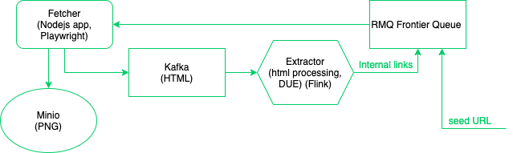

# Web Crawler
This repository contains the source code for the final work of the Otus Data Engineer course. The project is a focused web crawler that recursively crawls websites. It contains 3 parts:
1. The fetcher is a nodejs application. It reads URLs from the `frontier` RMQ queue, opens pages in the selected browser and stores their content in the `htmls` kafka topic (HTML) and the `screenshots` minio bucket (PNG).
2. The extractor is a flink job. It reads HTML documents from the `htmls` kafka topic, extracts internal links and pushes them to the `frontier` RMQ queue. The service also implements the logic for eliminating duplicate URLs (DUE) using the MapState.
3. The runner is a python script that runs the crawling.

## How to launch the crawling
* `docker-compose build`;
* `docker-compose up -d` (wait ~20 seconds);
* `docker-compose run -v /var/run/docker.sock:/var/run/docker.sock runner python run.py {domain}`

## Available endpoints
* RabbitMQ management console: http://localhost:15672/ (rmq:rmq123);
* Minio management console: http://localhost:9000/ (minio:minio123);
* Flink management console: http://localhost:8081.
